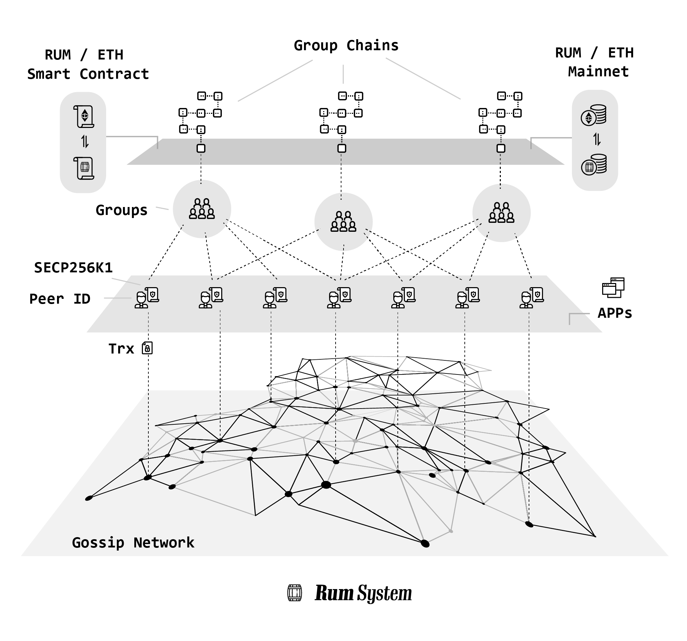

# RUM: The internet alternatives

### An open source peer-to-peer application infrastructure to offer the internet alternatives in a decentralized and privacy oriented way.

## Summary

The internet has become too centralized, and RUM is trying to find an alternative way to build online applications.

In the RUM system users are organized into groups, and each group will share a blockchain.

Group’s data will be encrypted and sync with all related users as events. All data will be stored in the group-shared-blockchain and eventually be consistent.

Applications can replay the blockchain locally and render the results on the user interface and interact with users.

There are no centralized server providers to store or process data.



## Concepts

**Peer**: A user with a pair of keys and connects to the peer-to-peer network.

**Group**: Multi peers or single peer can be organized into groups. A group can represent any online applications, a twitter-like SNS, a reddit-like community or a personal cloud notebook.

**Group Owner**: The creator of a group is the group owner, who will record any valid events transactions in this group and produce new blocks onto old blocks.

Group owners have more privileges, including authorizing other peers (as producers) to produce new blocks, or denying some peers to send events in this group.

**Producer**: Any peers with a public IP address and open ports (including port forwarding/UPnP) can become a producer, who can help the group owner to produce new blocks without reading encrypted events/messages. Producers may receive crypto incentives as reward from the group owner or users, depending on the consensus.

**Event/Message**: Any activity from users is regarded as an event, for example, creating a post, updating avatars, and replying to a post. Event transactions will be broadcast to the group owner and all producers, waiting to be recorded into the new block. RUM uses a subset of Activity Vocabulary Core Types to represent event types.

**Blockchain**: Events transactions will be recorded into blocks, then be linked together to become a blockchain.

**Gossip Network**: There are no centralized servers in the RUM network, the network is only constructed by peers. All event transactions/messages will be passed along to their neighbours peers until target peers receive it eventually.

**Bootstrap**: Bootstrap node is an address book which can help your peers to discover others peers through the DHT-KAD protocol. You can use AddPeer api to add any normal peers which you trust to bootstrap. However, bootstrap node/DHT is not the only way -- a peer will discover others by peer-exchange protocol in the gossip network.

## Why

The internet is broken.

Technology monopoly, especially social network monopoly, has become a worldwide problem. In the United States and the EU, technology companies have caused a lot of disputes over privacy and user data ownership issues. Criticism of traditional Internet platforms has long been a mainstream voice in various countries.

Almost all online services are running on Client-Server architecture, which means all users' activities and data will be stored in centralized servers. User's data always be controlled by service providers not themself, this made the internet centralized by nature.

People urgently need an innovative model that no longer adopts the "privacy for advertising" mode: a new type of network system where data is owned by users and has a special way to distribute traffic without being controlled by the enterprise.

RUM uses a different approach to rebuild the online service. Users will control their own data and interact with other related users in the peer-to-peer network.

## How (video, WIP)

## Ecosystem (WIP)

The [RUM tokens](https://etherscan.io/token/0x72313959c0346016bfba17fa29dcea109f3aa348) can be mined by a non-GPU proof of X algorithm with less energy consuming. After the mainnet launch, the chances of winning the reward is linked to the user's contribution to the network, including the data storage and network traffic.

### Why Do We Need RUM Tokens?

1. Anti-spam

Blocking or blacklists does not work on a decentralized system, so we must use an economic measure to stop abuses and spam. Any RUM network operations will need a small amount of RUM. This is the origin of the Hashcash and POW being invented, as well as the Bitcoin.

2. Resources contribution incentive

A peer-to-peer system must provide economic incentive to minimize the Free-rider problem. Peers share their computing and network resources to help keep the RUM network secure and robust, to get rewards they deserve from the network.

## Getting Started

**TL;DR**:  Try [rum-app](https://github.com/rumsystem/rum-app), a cross platform RUM GUI application.

### Build:

<span id="build_quorum"></span>

Build the quorum binary by running the [./scripts/build.sh](./scripts/build.sh) script.

### Build API Document:

Running:

```sh
./scripts/swag_init.sh
go run cmd/docs.go
```

and then open browser with <http://localhost:1323/swagger/index.html>.

*or*

Read the [RUM Development Tutorial](./Tutorial.md).

### Run a RUM peer

<span id="run_a_peer"></span>

Run the [quorum binary](#build_quorum):

```sh
./quorum -peername peer -listen /ip4/0.0.0.0/tcp/7000  -listen /ip4/0.0.0.0/tcp/9000/ws -apilisten 127.0.0.1:8000 -peer /ip4/94.23.17.189/tcp/10666/p2p/16Uiu2HAmGTcDnhj3KVQUwVx8SGLyKBXQwfAxNayJdEwfsnUYKK4u -configdir rum/peerConfig -datadir rum/peerData -keystoredir rum/keystore -debug true
```

OPTIONS:

```sh
   -peername    default:`peer`, used in and same with configdir  and datadir
   -listen      a multiaddress for the peer service listening
   -apilisten   http api  listening address
   -peer        a bootstrap peer multiaddress. Any online peer could be used for bootstrap, you can use the RUM testing bootstrap server for testing.
   -configdir   a directory for config files. The `peer` of `peerConfig` must same as peername `peer`, eg: if `mypeer2Config`, peername must be `mypeer2`.
   -datadir     all data storage location. The `peer` of `peerData` must same as peername `peer`, eg: if `mypeer2Data`, peername must be `mypeer2`.
   -keystoredir a directory to store private keys. All key files are password protected, and it\'s very important to keep backups of all your keys.
   -debug       enable logging level to debug or not
```

*or*

Try [rum-app](https://github.com/rumsystem/rum-app), a cross platform RUM GUI application.

### Example: a private decentralized forum

The main purpose of RUM is to connect groups of people without any centralized server. We start from a simple scenario of a private decentralized forum for a group of friends.

The [rum-app](https://github.com/rumsystem/rum-app) will help you create/join/post/view with a nice GUI.

The following shows how to create/join group and post/view content with [quorum binary](build_quorum) and command line.

1. [Run RUM peer](#run_a_peer) on each friend’s computer, so we have peerA, peerB, peerC...

2. PeerA will create the group, and A will become the owner of the group.

```bash
curl -k -X POST -H 'Content-Type: application/json' -d '{"group_name":"ourforum","consensus_type":"poa","encryption_type":"public","app_key":"group_bbs"}' https://127.0.0.1:8000/api/v1/group
```

The response is the group seed:

```json
{
    "genesis_block": {
        "BlockId": "989ffea1-083e-46b0-be02-3bad3de7d2e1",
        "GroupId": "01014e95-303e-4955-b06e-bf185556a729",
        "ProducerPubKey": "CAISIQPAeFZ8rgsENE12HgYwH+3N/aKsRN4fnPEUzEIY7ZyiAQ==",
        "Hash": "gg6/EpEfafZKigjXKiSSu4oFb86ko7cbk1c7AayASiQ=",
        "Signature": "MEYCIQC2n2lHD2Whe5m3Rn0FzlkwMN+7l2iuVMWsMqQPi4uroQIhAMFFd8kDcibptGzAhb7Pmh2CjvXzOGo0uQd55TDtNZ9d",
        "Timestamp": 1633022374646518065
    },
    "group_id": "01014e95-303e-4955-b06e-bf185556a729",
    "group_name": "ourforum",
    "owner_pubkey": "CAISIQPAeFZ8rgsENE12HgYwH+3N/aKsRN4fnPEUzEIY7ZyiAQ==",
    "owner_encryptpubkey": "age19732hyts2cs4s0xfm2js5fdd5zlrg7wtzaztcnsf7kcy0acgydksd6q3mu",
    "consensus_type": "poa",
    "encryption_type": "public",
    "cipher_key": "accb6a4faf34734c418683a9c62bb61209dc79380b69dab20b5042694009dfda",
    "app_key": "group_bbs",
    "signature": "3046022100b0676faad185a8af627ea98549688e1d0b15164c3b95dd45c756b27194671287022100f0f32dfb4bb8729d0b63fdc3f068e54ff22b3c6c2fc092ab3c8a2c382df22683"
}
```

> [API: create group](./Tutorial.md#api-create-group)

3. Share the group seed with your friends, so they can join your group with the seed.

4. Join the group with Peer B, C...

```bash
curl -k -X POST -H 'Content-Type: application/json' -d '{"genesis_block":{"BlockId":"989ffea1-083e-46b0-be02-3bad3de7d2e1","GroupId":"01014e95-303e-4955-b06e-bf185556a729","ProducerPubKey":"CAISIQPAeFZ8rgsENE12HgYwH+3N/aKsRN4fnPEUzEIY7ZyiAQ==","Hash":"gg6/EpEfafZKigjXKiSSu4oFb86ko7cbk1c7AayASiQ=","Signature":"MEYCIQC2n2lHD2Whe5m3Rn0FzlkwMN+7l2iuVMWsMqQPi4uroQIhAMFFd8kDcibptGzAhb7Pmh2CjvXzOGo0uQd55TDtNZ9d","Timestamp":1633022374646518065},"group_id":"01014e95-303e-4955-b06e-bf185556a729","group_name":"ourforum","owner_pubkey":"CAISIQPAeFZ8rgsENE12HgYwH+3N/aKsRN4fnPEUzEIY7ZyiAQ==","owner_encryptpubkey":"age19732hyts2cs4s0xfm2js5fdd5zlrg7wtzaztcnsf7kcy0acgydksd6q3mu","consensus_type":"poa","encryption_type":"public","cipher_key":"accb6a4faf34734c418683a9c62bb61209dc79380b69dab20b5042694009dfda","app_key":"group_bbs","signature":"3046022100b0676faad185a8af627ea98549688e1d0b15164c3b95dd45c756b27194671287022100f0f32dfb4bb8729d0b63fdc3f068e54ff22b3c6c2fc092ab3c8a2c382df22683"}' https://127.0.0.1:8001/api/v1/group/join
```

> [API: join group](./Tutorial.md#api-join-group)

5. Check the group status

```bash
curl -k https://127.0.0.1:8000/api/v1/groups
```

Response:

```json
{
    "groups": [
        {
            "group_id": "01014e95-303e-4955-b06e-bf185556a729",
            "group_name": "ourforum",
            "owner_pubkey": "CAISIQPAeFZ8rgsENE12HgYwH+3N/aKsRN4fnPEUzEIY7ZyiAQ==",
            "user_pubkey": "CAISIQPAeFZ8rgsENE12HgYwH+3N/aKsRN4fnPEUzEIY7ZyiAQ==",
            "consensus_type": "POA",
            "encryption_type": "PUBLIC",
            "cipher_key": "accb6a4faf34734c418683a9c62bb61209dc79380b69dab20b5042694009dfda",
            "app_key": "group_bbs",
            "last_updated": 1633022375303983600,
            "highest_height": 0,
            "highest_block_id": [
                "989ffea1-083e-46b0-be02-3bad3de7d2e1"
            ],
            "group_status": "IDLE"
        }
    ]
}
```

> [API: groups](./Tutorial.md#api-get-groups)

6. "group_status": "IDLE"  means the group is ready to use. Check the group_status on PeerB, C... make sure group_status is IDLE on every peer.

> [API: start sync](./Tutorial.md#api-post-startsync)

7. It's time to create your first forum post.

```bash
curl --insecure -X POST -H 'Content-Type: application/json' -d '{"type":"Add","object":{"type":"Note","content":"The Future Will Be Decentralized","name":"My First Post!"},"target":{"id":"01014e95-303e-4955-b06e-bf185556a729","type":"Group"}}' https://127.0.0.1:8000/api/v1/group/content
```

Response:

```json
{
    "trx_id": "0ad70ee3-b6de-4a19-9b3d-f02c037e6a52"
}
```

> [API: post content](./Tutorial.md#api-post-content)

8. Waiting about 10s to sync the blockchain, then check the groups status again.

```bash
curl -k https://127.0.0.1:8000/api/v1/groups
```

Response:

```json
{
    "groups": [
        {
            "group_id": "01014e95-303e-4955-b06e-bf185556a729",
            "group_name": "ourforum",
            "owner_pubkey": "CAISIQPAeFZ8rgsENE12HgYwH+3N/aKsRN4fnPEUzEIY7ZyiAQ==",
            "user_pubkey": "CAISIQPAeFZ8rgsENE12HgYwH+3N/aKsRN4fnPEUzEIY7ZyiAQ==",
            "consensus_type": "POA",
            "encryption_type": "PUBLIC",
            "cipher_key": "accb6a4faf34734c418683a9c62bb61209dc79380b69dab20b5042694009dfda",
            "app_key": "group_bbs",
            "last_updated": 1633024842663874300,
            "highest_height": 1,
            "highest_block_id": [
                "a835ea5f-ece1-4ba4-94f3-782470dff8c6"
            ],
            "group_status": "IDLE"
        }
    ]
}
```

You will find the group’s highest_height becomes 1, and the highest_block_id also changed.

Check the group_status on PeerB, C ... , All peers should have the same highest_height and highest_block_id which means that all peers have been synchronized successfully.

9. View the posts.

```bash
curl -k -X POST -H 'Content-Type: application/json' -d '{"senders":[]}' "https://localhost:8000/app/api/v1/group/01014e95-303e-4955-b06e-bf185556a729/content?num=20&reverse=false"
```

Response:

```json
[
    {
        "TrxId": "0ad70ee3-b6de-4a19-9b3d-f02c037e6a52",
        "Publisher": "CAISIQNc7wg3VLZCbKHetaqbZdUro/IUSy33ypWPoI4J24L6gw==",
        "Content": {
            "type": "Note",
            "content": "The Future Will Be Decentralized",
            "name": "My First Post!"
        },
        "TypeUrl": "quorum.pb.Object",
        "TimeStamp": 1633024832659417600
    }
]
```

Congratulations, You have a fully decentralized forum now. Every peer can view the forum posts from their peers.All the data belongs to you and your friends, there is no other service provider or centralized storage.

10. Next:

Add more producers to prevent outages.

> [API: producers](./Tutorial.md#test-producers)

---

### Run a RUM peer on server

1. Build the quorum binary by running the [./scripts/build.sh](./scripts/build.sh) script.
2. Add a shell script to run the peer:

```bash
RUM_KSPASSWD=your_very_secret_password ./dist/linux_amd64/quorum -peername your_peer_name -listen /ip4/0.0.0.0/tcp/7002 -listen /ip4/0.0.0.0/tcp/7100/ws -apilisten :8002 -peer /ip4/94.23.17.189/tcp/10666/p2p/16Uiu2HAmGTcDnhj3KVQUwVx8SGLyKBXQwfAxNayJdEwfsnUYKK4u -configdir /var/data/your_peer_nameConfig -datadir /var/data/your_peer_nameData -keystoredir /var/data/keystore -debug true
```

[view OPTIONS](#run_a_peer)

3. Run the shell script.

Tips: You can use our public bootstrap peer ```/ip4/94.23.17.189/tcp/10666/p2p/16Uiu2HAmGTcDnhj3KVQUwVx8SGLyKBXQwfAxNayJdEwfsnUYKK4u``` or any other online peers as bootstrap.
